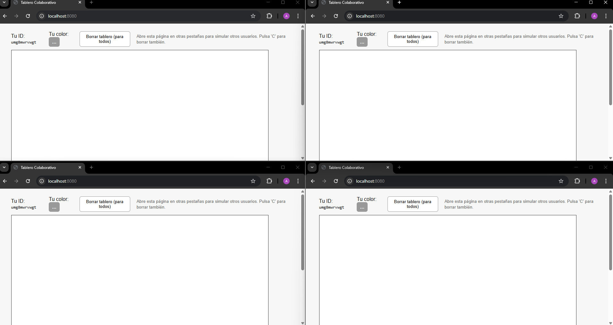

# IntroduccionReactARSW

1. Para la creación del ambiente de trabajo usamos spring initializr el cual genera de forma automáticamente el scafolding y añadiendo la dependencia de spring web tendriamos todo lo necesario para arrancar.

2. Haciendo uso del código brindado en la guía arrancamos el servidor y en el navegador ponemos ```localhost:8080/status``` para ver que si este funcionando

    

3. También verificamos que esté sirviendo recursos estáticos accediendo a la ruta de ```index.html```:

    

4. Siguiendo con los pasos del taller ágregamos las etiquetas ```<script>``` a nuestro archivo ```index.html``` y creamos el componente ``FirstComponent,jsx``:

   

   

    
 
5. Cambiamos el código tal y como indica la guía de manera que ahora sale lo siguiente:

   

     

6. Continuando con la guia añadimos el nuevo código a nuestro componente:

    

   Quedando de la siguiente manera:

    

7. Para terminar se nos pide implementar un tablero colaborativo en el que se le permita a multiples usuarios dibujar en el mismo tablero y que cada uno cuente con un color diferente. Ádemas debe haber un botón de borrar el tablero.

   Para ello y a recomendación de la guía hacemos uso de la librería ``p5`` de javascript agregandola al ``<head>`` de nuestro archivo ``index.html``:

    

   Y luego creamos un nuevo componente ``app.jsx`` en el que se almacena toda la lógica y un archivo ``styles.css`` para la parte visual.

   Este componente implementa el tablero colaborativo usando React + p5.js y localStorage/sessionStorage para simular colaboración en tiempo real entre pestañas del navegador. A continuación se explica su arquitectura, las piezas clave y cómo probarlo.
   
   **Claves y constantes**
   
   - ``KEY_STROKES = 'shared_drawing_strokes_v1'``: clave en localStorage donde se guardan los trazos compartidos.
   
   - ``KEY_USERS = 'shared_drawing_users_v1'``: mapa de usuarios activos a colores (guardado en localStorage).
   
   - ``KEY_CLEAR = 'shared_drawing_clear_v1'``: flag de borrado global (timestamp) para forzar limpieza en todas las pestañas.
   
   - ``PALETTE``: paleta de colores disponible; cada pestaña recibe preferentemente un color distinto.
   
   **Identificación de cada pestaña / usuario**
   
   - Cada pestaña obtiene un identificador único guardado en sessionStorage (drawing_my_id). Esto hace que cada pestaña sea considerada un usuario distinto incluso en el mismo navegador.
   
   - El identificador se usa como clave en KEY_USERS para asignar/reusar un color desde la paleta.
   
   - Al cerrar la pestaña se elimina la asignación de KEY_USERS (evento beforeunload) para permitir que nuevos usuarios tomen ese color.
   
   **Modelo de datos: trazo**
   
   Cada trazo se representa como un objeto simple:
   
   ```js
   {
   id: 'sXXXXXXXX',     // id del stroke
   userId: 'uYYYYYYY',  // id de la pestaña que dibujó
   color: '#rrggbb',    // color del usuario en el momento
   size: 14,            // grosor (opcional)
   points: [{x,y}, ...] // lista de puntos que forman el trazo
   }
   ```
   
   ``KEY_STROKES`` guarda un array de estos trazos en JSON.
   
   **Flujo de dibujos (cliente)**
   
   - ``p5`` crea un canvas y registra handlers:
   
     - ``mousePressed`` inicia un ``current`` stroke con el color y primer punto.
   
     - ``mouseDragged`` agrega puntos al current.
   
     - ``mouseReleased`` empuja él ``current`` a ``pendingRef`` y lo agrega a ``strokesRef`` para render inmediato.
   
   - ``strokesRef`` contiene todos los trazos que se muestran en pantalla; ``currentRef`` es el trazo en construcción; ``pendingRef`` son trazos locales aún no persistidos.
   
   **Persistencia y simulación de tiempo real**
   
   **Flush:** un interval (cada 200ms) lee ``pendingRef`` y lo concatena en ``localStorage[KEY_STROKES]``. Esto agrupa/batchea las escrituras para reducir operaciones frecuentes.
   
   **Poll** + **storage event**: otro interval (cada 250ms) lee ``KEY_STROKES`` y ``KEY_CLEAR``. Además, se escucha el evento ``storage`` para aplicar cambios más rápido entre pestañas. Si detecta cambios actualiza ``strokesRef`` y el canvas se redibuja automáticamente.
   
   Al pulsar el botón **Borrar tablero (para todos)** se escribe ``[]`` en ``KEY_STROKES`` y un timestamp en ``KEY_CLEAR`` para que todas las pestañas borren su vista.
   
   **Renderizado**
   
   - En el bucle ``p.draw()`` se pinta:
   
     1. Fondo blanco.
   
     2. Todos los trazos de ``strokesRef`` (cada punto se dibuja como un círculo).
   
     3. El trazo actual (``currentRef``) para que el usuario vea lo que está dibujando mientras arrastra.
   
   El programa ejecutado se muestra en las imágenes de debajo:
   
    
   
   

   Al dar click al boton de borrar para todo, efectivamente todos los tableros quedan en blanco:

   


   
